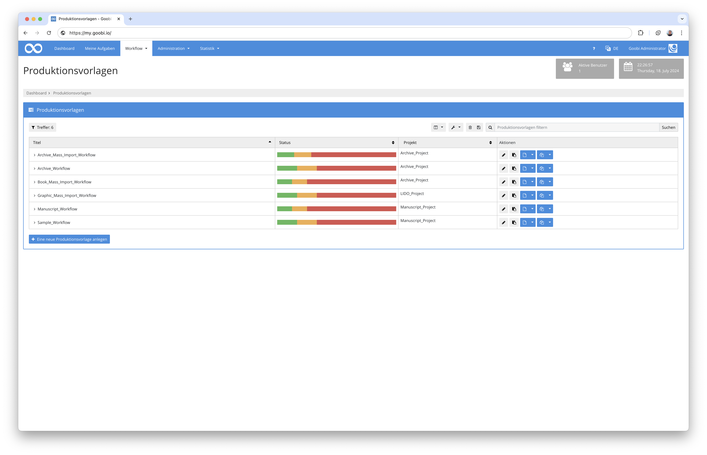
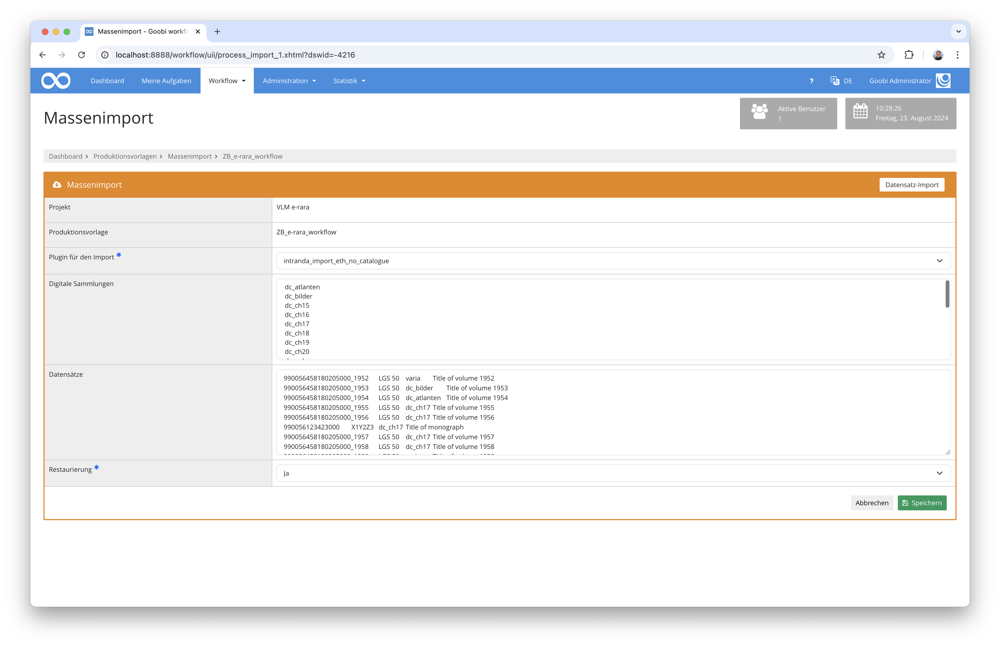

## Einführung
Dieses Import-Plugin erlaubt ZZZ.

## Installation
Um das Plugin nutzen zu können, müssen folgende Dateien installiert werden:

```bash
/opt/digiverso/goobi/plugins/import/plugin-import-ZZZ-base.jar
/opt/digiverso/goobi/config/plugin_intranda_import_ZZZ.xml
```

Nach der Installation des Plugins, kann dieses aus der Übersicht der Produktionsvorlagen durch Nutzung des zweiten blauen Buttons neben der gewählten Produktionsvorlage betreten werden.



Wenn das Plugin betreten wurde, steht eine Nutzeroberfläche zur Verfügung, in der die einzuspielenden Daten ausgewählt bzw. hochgeladen werden können.




## Überblick und Funktionsweise
Unmittelbar nach Auswahl bzw. Einspielen der zu importierenden Daten beginnt bereits eigentliche Import. Hierzu geht des Plugin folgendermaßen vor:

ZZZ


## Konfiguration
Die Konfiguration des Plugins erfolgt in der Datei `plugin_intranda_import_ZZZ.xml` wie hier aufgezeigt:

{{CONFIG_CONTENT}}

Die folgende Tabelle enthält eine Zusammenstellung der Parameter und ihrer Beschreibungen:

Parameter               | Erläuterung
------------------------|------------------------------------
``                      | 
``                      | 
``                      | 
``                      | 
``                      | 
``                      | 
``                      | 
``                      | 
``                      | 
``                      | 
``                      | 
``                      | 
``                      | 
``                      | 
``                      | 
``                      | 
``                      | 
``                      | 
``                      | 
``                      | 
``                      | 
``                      | 
``                      | 
``                      | 
``                      | 
``                      | 
``                      | 
