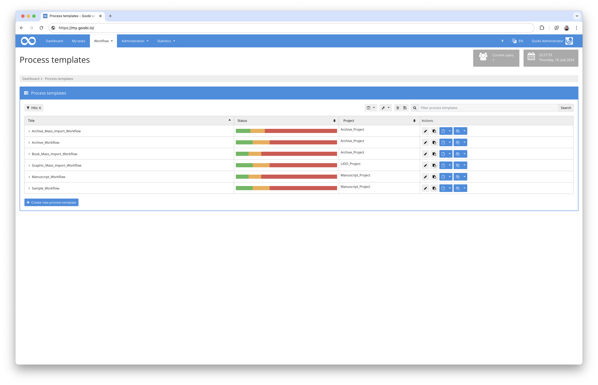
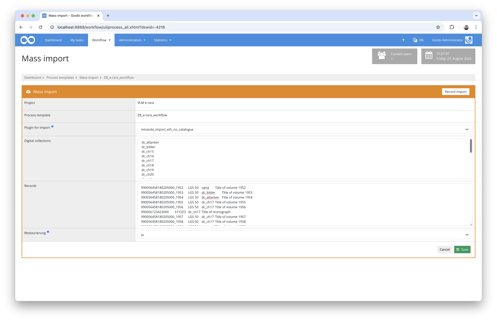

## Introduction
This import plugin allows you to ZZZ.

## Installation
To be able to use the plugin, the following files must be installed:

```bash
/opt/digiverso/goobi/plugins/import/plugin-import-ZZZ-base.jar
/opt/digiverso/goobi/config/plugin_intranda_import_ZZZ.xml
```

Once the plugin has been installed, it can be accessed from the overview of production templates by using the second blue button next to the selected production template.



Once the plugin has been entered, a user interface is available in which the data to be imported can be selected or uploaded.




## Overview and functionality
Immediately after selecting or importing the data to be imported, the actual import begins. The plugin proceeds as follows:

ZZZ


## Configuration
The plugin is configured in the file `plugin_intranda_import_ZZZ.xml` as shown here:

{{CONFIG_CONTENT}}

The following table contains a summary of the parameters and their descriptions:

Parameter               | Explanation
------------------------|------------------------------------
``                      | 
``                      | 
``                      | 
``                      | 
``                      | 
``                      | 
``                      | 
``                      | 
``                      | 
``                      | 
``                      | 
``                      | 
``                      | 
``                      | 
``                      | 
``                      | 
``                      | 
``                      | 
``                      | 
``                      | 
``                      | 
``                      | 
``                      | 
``                      | 
``                      | 
``                      | 
``                      | 
